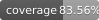

## GyRAPH - a Framework for Directed Graph Signal Processing

GyRAPH is a framework for signal processing on directed graphs. It can be easily integrated to pipelines and to various applications. 

### Installation

Run the command if you already have all the required packages:
`pip install -i https://test.pypi.org/simple/ flowGSP`

Otherwise run the command:
`pip install --index-url https://test.pypi.org/simple/ --extra-index-url https://pypi.org/simple/ flowGSP`